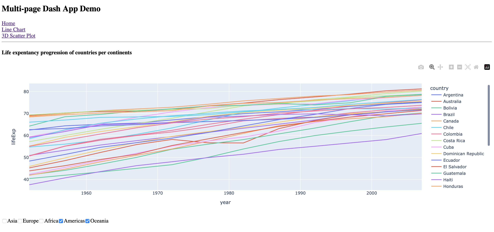
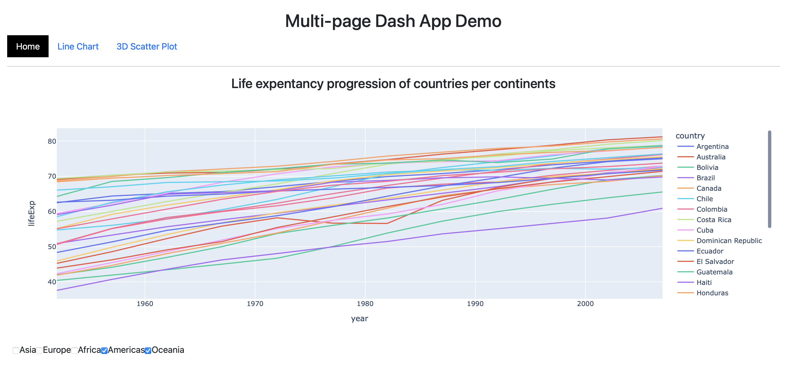
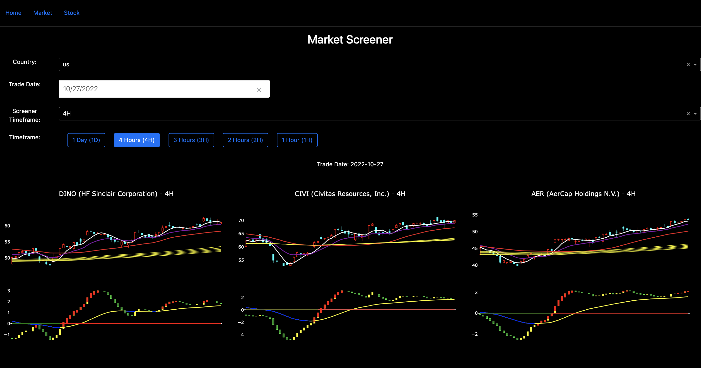

# Python Flask Plotly Dash Multi-page App

[](https://www.python.org)
[](https://flask.palletsprojects.com/en/2.2.x/)
[](https://pypi.org/project/pandas/)
[](https://plotly.com)
[](https://plotly.com)

Data Visualization is a critical process in Data Science to understand trends, patterns, or variations, and deliver
meaningful insights to the target audience.

In Python, [Matplotlib](https://matplotlib.org), [Seaborn](https://seaborn.pydata.org), and [Boken](https://bokeh.org)
are the popular libraries to visualize data, [Plotly Dash](https://plotly.com) is another powerful framework to build
highly interactive, scalable, complex data analytics app, with a high level of customization and an attractive
appearance.

You will be capable to build and embed a multi-page Plotly Dash Application into your Flask Application by following
this tutorial.

## Installation

Use the package manager [pip](https://pip.pypa.io/en/stable/) to install required libraries in `requirements.txt`.

```bash
pip install -r requirements.txt
```

## Build a Multi-page Dash App

[Dash Pages](https://dash.plotly.com/urls) provides certain components and callbacks required for URL routing.

### Project Structure

Here is the sample structure for a multi-page app with Dash Pages:

```
- app.py
- pages
   |-- home.py
   |-- demo_page_1.py
   |-- demo_page_2.py
```

### Sample

The entry point of the multi-page app is the `app.py` file, meanwhile, the pages will be displayed
in `dash.page_container`. Each page has to be registered with a unique path.

`pages/demo_page_1.py`:

```python
import dash

dash.register_page(__name__, path='/line-chart-demo')
...
```

`app.py`:

```python
import dash
from dash import Dash, html, dcc

app = Dash(__name__, use_pages=True)

app.layout = html.Div(
    children=[
        html.H2('Multi-page Dash App Demo'),
        dcc.Link('Home', href='/'),
        html.Br(),
        dcc.Link('Line Chart', href='/line-chart-demo'),
        html.Br(),
        dcc.Link('3D Scatter Plot', href=f'/scatter-plot-demo'),
        html.Hr(),
        dash.page_container
    ])

if __name__ == '__main__':
    app.run_server(debug=False)
```



## Dash App Styling

There are multiple ways to make our Dash App visually appealing,
the [dash_bootstrap_components](https://dash-bootstrap-components.opensource.faculty.ai/docs/themes/) library allows
users to customize the app with different Bootstrap and Bootswatch themes.

Despite the `style` argument in individual components, [Dash](https://dash.plotly.com/external-resources) also enables
users to include external CSS and JavaScript in the Dash application with the folder `assets`.

### Project Structure

Here is the sample structure to add customized CSS stylesheet or JavaScript:

```
- app.py
- assets
   |-- style.css
   ...
- pages
   ...
```

### Sample

`app.py`:

```python
import dash
from dash import Dash, html
import dash_bootstrap_components as dbc

app = Dash(__name__,
           use_pages=True,
           external_stylesheets=[dbc.themes.BOOTSTRAP],  # 1st: add external stylesheet
           )

app.layout = html.Div(children=[
    html.H2(children='Multi-page Dash App Demo', style={'text-align': 'center'}),
    dbc.Nav([dbc.NavItem(dbc.NavLink('Home', id='style-demo', href=f'/')),  # 2nd: assign id for styling with style.css
             dbc.NavItem(dbc.NavLink('Line Chart', href=f'/line-chart-demo')),
             dbc.NavItem(dbc.NavLink('3D Scatter Plot', href=f'/scatter-plot-demo')),
             ]),
    html.Hr(),
    dash.page_container
],
    # 3rd: style argument in dash components
    style={'margin': '20px'}
)

if __name__ == '__main__':
    app.run_server(debug=False)
```

`assets/style.css`:

```css
#style-demo {
    color: #ffffff;
    background-color: #000000;
}

.chart-title {
    text-align: center;
}
```



Appearance matters when you are delivering results to external parties. **Get original style and make a beautiful Dash
App!**

## Embed Dash App into Flask App

The last section covers how to integrate Dash into Flask, the following are the required processes:

1. Initiate a Flask instance, and pass it into Dash with the `server` argument
2. Define pathname for Dash in the `url_base_pathname` argument; Modify the corresponding page path
3. Re-route to Dash with a function that return `app_dash.index()`
4. Run Flask instead of Dash, i.e. `app_flask.run()` instead of `app_dash.run_server()`

### Sample

```python
import dash
from dash import Dash, html
import flask
import dash_bootstrap_components as dbc

DASH_APP_URL = '/dashapp'

# Web app
app_flask = flask.Flask(__name__)  # Flask
app_dash = Dash(__name__,
                use_pages=True,
                external_stylesheets=[dbc.themes.BOOTSTRAP],  # 1st: add external stylesheet
                url_base_pathname=f'{DASH_APP_URL}/',
                server=app_flask,
                )


# Flask app
@app_flask.route(rule='/')
def home_page():
    return 'This is the home page served with Flask'


@app_flask.route(rule=f'{DASH_APP_URL}/')
def my_dash_app():
    return app_dash.index()


# Dash app
app_dash.layout = html.Div(children=[
    html.H2(children='Multi-page Dash App Demo', style={'text-align': 'center'}),
    dbc.Nav([dbc.NavItem(dbc.NavLink('Home', id='style-demo', href=f'{DASH_APP_URL}/')),
             # 2nd: assign id for styling with style.css
             dbc.NavItem(dbc.NavLink('Line Chart', href=f'{DASH_APP_URL}/line-chart-demo')),
             dbc.NavItem(dbc.NavLink('3D Scatter Plot', href=f'{DASH_APP_URL}/scatter-plot-demo')),
             ]),
    html.Hr(),
    dash.page_container
],
    # 3rd: style argument in dash components
    style={'margin': '20px'}
)

if __name__ == '__main__':
    port = 5000
    print(f'Flask: http://localhost:{port}/')
    print(f'Dash: http://localhost:{port}{DASH_APP_URL}')

    # Run Flask
    app_flask.run(debug=False, port=port, host='0.0.0.0')
    # app_dash.run_server(debug=False)

```

## Personal Project Example

Here is an example of a personal project that I have already deployed to AWS, and shared with other developers. It works
well in the app interaction and connection to SQL database (e.g. AWS RDS).



Dash is a low-code framework to craft interactive, complex web apps to visualize data analytics with customized user
interfaces. Plus, it could be rapidly integrated into your work, study, or own business. Navigate to
the [documentation](https://dash.plotly.com/installation) and start building your first Dash app now!

## License

See the [LICENSE](LICENSE.md) file for license rights and limitations (MIT).